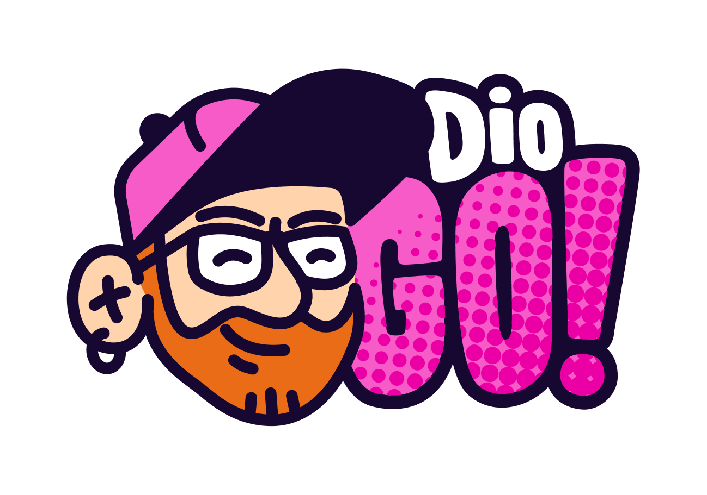
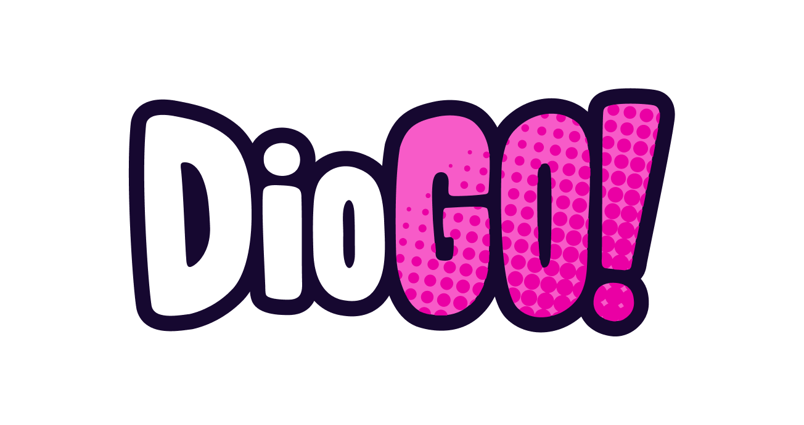

  

  

## Sobre Mim

> _"Internet Dinosaur, mais velho que um 💾. ♥️ tecnologia!"_

Olá! Sou o **Diogo Cezar**, um apaixonado por tecnologia com **18+ anos de experiência** e Mestrado em IA. Sou conhecido por transformar ideias em realidade e construir equipes de alta performance! 🎯

### Principais Conquistas

- **🎯 200k+ novos clientes** na integração Neon/MEI Fácil
- **🚀 Top 100 startups de IA** com a Typper (50k+ usuários)
- **⚡ 2x mais rápido** nas entregas na Bankme
- **🔗 3k+ dispositivos conectados** na V3 Tecnologia
- **👨‍🏫 Ex-professor UTFPR** e mentor de carreira

## Stack Tecnológica

### Linguagens & Frameworks

### Cloud & DevOps

### Databases

## Experiência Profissional

### 🎯 Head of Technology @V3Tecnologia

- 🚀 Liderança de equipe tech e arquiteturas robustas
- 🔒 Melhorias em segurança, escalabilidade e 3k+ dispositivos conectados

### 🚀 CEO/Advisor @Typper

- 🏆 Top 100 startups de IA no Brasil com 50k+ usuários ativos
- 🤖 Geração de 15k+ imagens, 17k+ textos e 35k+ códigos via IA

### 💼 Head of Technology @Bankme

- ⚡ Dobrou velocidade de entrega e migrou arquitetura monolítica → modular
- ☁️ Migração AWS → GCP e construção de cultura tech forte

### 🛒 Tech Lead @ Luizalabs @Magalu

- 💳 MagaluPay Tribe: Wallet Magalu, Digital Account e preparação Black Friday

### 🏦 Back End Coordinator @Neon

- 🎯 Integração MEI Fácil + Neon resultando em 200k+ novos clientes no primeiro ano

## Formação Acadêmica

- 🎓 **PhD em Engenharia de Computação** (créditos) - UFPR _(2022)_
- 🎓 **Mestrado em Ciência da Computação** (IA) - UFPR _(2010-2012)_
- 🎓 **Tecnologia em Sistemas de Informação** - UTFPR _(2004-2007)_

## Soft Skills

## Interesses & Fun Facts

### 🤖 **Tech & Carreira**

- **IA & Machine Learning**: Mestrado em IA e apaixonado por novas tecnologias
- **Liderança & Mentoria**: Ex-professor UTFPR e mentor de carreira
- **DevOps & Arquitetura**: Especialista em escalabilidade e performance

### 🎮 **Hobbies & Personalidade**

- **Gaming**: Apaixonado por jogos e tecnologia
- **Rock Clássico**: Fã de rock clássico
- **Comunidade**: Mentorias gratuitas e participação em meetups tech

### 🦕 **Curiosidades**

- **Internet Dinosaur**: Estou aqui a bastante tempo
- **AI Enthusiast**: Sempre explorando novas possibilidades da IA
- **BBB**: Passei 36 horas na casa do BigBrother Brasil

 

## Entre em Contato

  
  
  
  

  

  

